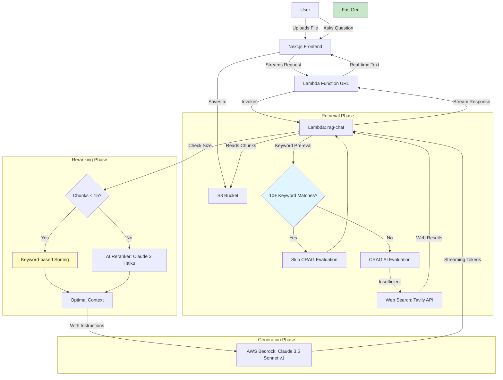

# Design Concept Generator

設計構想書を自動生成するための Next.js アプリケーション。AWS Amplify を使用した認証機能と、チャットボット機能を備えています。

## 📋 概要

このアプリケーションは、以下の機能を提供します：

- **ドキュメントアップロード**: 設計構想書、商品企画書、製品企画書などの入力資料をアップロード (S3)
- **コンポーネント選択**: テールゲート、フロントバンパー、フードなどの対象コンポーネントを選択
- **Real RAG 生成**: アップロードされた資料の中身を解析し、設計構想書を自動生成。文中の引用番号（`[1]`等）は「参考文献」セクションに自動的にリンク・集約されます。
- **引用付きチャットボット**: アップロード資料に基づいた回答を行い、文中に `[1]` のような参照番号を付与。回答の末尾に出典リスト（ファイル名やURL）を明示します。
    1. **Web検索結果 (最新トレンド・法規)**
    2. **設計構想書 (最重要)**
    3. 商品計画書
    4. 製品企画書
    5. 法規リスト
- **インターネット検索 (Improved Web Search)**: 「Tavily AI Search API」を統合。
    - **権威性フィルター**: SNSやQ&Aサイトを除外し、政府・大学・公式サイトなどの信頼できる情報源を優先します。
    - **スマートトリガー**: 「ネットで調べて」等の**明示的な指示**や、法規・規制関連の質問、最新トレンド・社内資料不足時に自動的に発動します。
    - **生成機能への対応**: 設計構想書の自動生成時にも、不足情報がある場合は自動的にWeb検索を行い、最新情報を反映します。
- **Smart Fallback Mechanism (強化版)**: 内部資料の関連度が低い場合（Score < 6.0）、自動的にWeb検索を実行。社内知識と外部知識をシームレスに統合し、「分かりません」という回答を最小限に抑えます。
- **Citation Management (参考資料管理)**: 
    - **統一された番号管理**: 同じドキュメントの複数箇所を引用する場合でも、すべて同じ番号（例：[1]）で統一表示
    - **重複排除**: 同じファイルから複数のチャンクが使われた場合でも、参考資料リストに重複表示されません
    - **クリーンな表示**: ファイル名のみを表示（パスと拡張子を除去）し、読みやすさを向上
    - **Web検索結果の明示**: インターネット検索結果にはURL付きで表示され、情報源が明確
- **Smart AI Reranking (高精度化 + 最適化)**: 検索した資料をLLM (Claude 3 Haiku) が「質問との関連度」で採点。チャンク数が15未満の場合はキーワードベースの軽量ソートを使用し、**不要なAPI呼び出しを30-40%削減**。これにより**ハルシネーション（嘘の回答）**を劇的に低減しながらコストも最適化
- **AppSync GraphQL API**: Lambda関数をAppSync経由で呼び出し、認証とデータ管理を統合。完全なJSON レスポンス形式で安定した動作を実現
- **適応型リトライ戦略**: Bedrockへのリクエストをエクスポネンシャルバックオフ付きで最適化。レート制限エラーを回避しながら信頼性を向上
- **ファイル処理ステータス表示**: アップロードされたファイルの解析状況（処理中/準備完了）をリアルタイムで可視化
- **統合された履歴管理**:
    - **チャット履歴**: 設計アシスタント内で過去のQ&Aを確認・削除可能（Soft Delete対応）
    - **生成履歴**: 出力パネル内で過去に生成した設計構想書を確認・削除可能（Soft Delete対応）
    - **エラーハンドリング強化**: 破損データがあってもページがクラッシュせず、適切なエラーメッセージを表示
- **ユーザー情報表示**: ログイン中のユーザーID（メールアドレス）をヘッダーに表示
- **認証機能**: AWS Amplify による安全なユーザー認証
- **エラーログ強化 (2026/02)**: Tavily API エラーの詳細ログ記録により、Web検索トラブルシューティングが迅速化
- **UX改善 (2026/02)**: LLM内部の`<thinking>`タグおよび`<answer>`タグを除去し、クリーンな応答表示を実現

## 🚀 技術スタック

- **フレームワーク**: Next.js 14.2.16 (App Router)
- **言語**: TypeScript
- **UI**: React 18.3.1
- **スタイリング**: Tailwind CSS 4.0
- **認証**: AWS Amplify 6.6.1
- **バックエンド**: AWS AppSync (GraphQL API)
- **生成AI**: AWS Bedrock (Claude 3.5 Sonnet v1 - 東京リージョン)
- **Rerank AI**: AWS Bedrock (Claude 3 Haiku) with Smart Conditional Execution
- **検索API**: Tavily AI Search API with CRAG Evaluation
- **最適化**: Smart Reranking, Conditional CRAG, Keyword-based Pre-filtering
- **開発環境**: Node.js 20+

## 📁 プロジェクト構造

```
design-concept/
├── app/                    # Next.js App Router
│   ├── page.tsx           # メインダッシュボード
│   ├── login/             # ログインページ
│   ├── layout.tsx         # ルートレイアウト
│   └── globals.css        # グローバルスタイル
├── components/            # Reactコンポーネント
│   ├── AuthProvider.tsx   # 認証プロバイダー
│   └── Chatbot.tsx        # チャットボット
├── amplify/               # Amplify バックエンド定義
│   ├── auth/              # 認証リソース
│   ├── data/              # データリソース (AppSync)
│   ├── storage/           # ストレージリソース (S3)
│   └── functions/         # Lambda関数
│       └── rag-chat/      # RAGチャットボット (Web検索 + Rerank)
├── lib/                   # ユーティリティ
├── public/                # 静的ファイル
└── package.json          # 依存関係
```

## 🔧 セットアップ

### 前提条件

- Node.js 20 以上
- npm または yarn、pnpm、bun
- **Tavily API Key** (検索機能を使用する場合)

### インストール

```bash
# リポジトリをクローン（またはディレクトリに移動）
cd C:\cairo\design-concept

# 依存関係をインストール
npm install
```

### 開発サーバーの起動

```bash
npm run dev
```

ブラウザで [http://localhost:3000](http://localhost:3000) を開いてアプリケーションを確認できます。

## 📝 使い方

1. **ログイン**: AWS Amplify 認証でログイン
2. **ドキュメントアップロード**: 以下の資料をアップロード
   - 設計構想書
   - 商品企画書
   - 製品企画書
   - ハードウエア設計者の対応するリスト
   - 専門家の研究資料
   - 法規リスト
3. **コンポーネント選択**: 対象コンポーネントを選択
4. **ステータス確認**: アップロードしたすべてのファイルが「準備完了」になっていることを確認
5. **生成**: 設計構想書を生成
6. **質問 (チャット)**: 「2025年の法規トレンドは？」など、資料にないことも質問可能（Web検索が作動します）

## 🛠️ 開発コマンド

```bash
# 開発サーバーを起動
npm run dev

# 本番ビルド
npm run build

# 本番サーバーを起動
npm run start

# リント
npm run lint
```

## ☁️ AWS Amplify Setup

### 1. 前提条件
- AWS アカウント
- AWS CLI が設定済みであること

### 2. 環境変数の設定 (Secrets)
ウェブ検索機能を使用するには、Amplify Console で以下のシークレットを設定する必要があります。
1. Amplify Console > アプリ選択 > Hosting > Secrets
2. `Manage secrets` をクリック
3. 以下のキーと値を設定:
   - Key: `TAVILY_API_KEY`
   - Value: `tvly-xxxx...` (あなたのTavily APIキー)

### 3. ローカル開発環境 (Sandbox)
シークレットを設定するには以下のコマンドを使用します：

```bash
# シークレットの設定
npx ampx sandbox secret set TAVILY_API_KEY

# Sandboxの起動
npx ampx sandbox
```
これにより、隔離されたAWS環境がプロビジョニングされ、`amplify_outputs.json` が生成されます。

### 4. デプロイ
GitHubリポジトリにプッシュし、Amplify ConsoleまたはVercelでリポジトリを接続してデプロイします。

## 🔐 認証

このアプリケーションは AWS Amplify を使用してユーザー認証を管理しています。`AuthProvider` コンポーネントが認証状態を管理し、未認証ユーザーをログインページにリダイレクトします。

## 📦 主な依存関係

- `next`: Next.js フレームワーク
- `react` / `react-dom`: React ライブラリ
- `aws-amplify`: AWS Amplify SDK
- `@aws-amplify/ui-react`: Amplify UI コンポーネント
- `tailwindcss`: CSS フレームワーク
- `typescript`: TypeScript
- `pdf-parse`: PDFテキスト抽出
- `axios`: HTTPクライアント (Tavily API用)

## 🏗️ アーキテクチャ (Advanced RAG 2.0 - Optimized)



### RAG (Retrieval-Augmented Generation) フロー - 最適化版

1.  **Retrieval (検索) with Smart Evaluation**: 
    *   S3からアップロード資料のチャンクを取得
    *   **キーワード事前評価**: 5個以上のキーワードマッチがある場合、AI評価をスキップ（**50-70%のAPI呼び出し削減**）
    *   **Conditional CRAG**: 必要な場合のみClaude 3 Haikuで精密評価し、不十分な時だけTavily APIでWeb検索
    
2.  **Smart Reranking (再ランク付け) with Conditional AI**: 
    *   **チャンク数 < 15**: キーワードベースの軽量ソートのみ使用（**30-40%のAPI呼び出し削減**）
    *   **チャンク数 ≥ 15**: Claude 3 Haikuで関連度を0-10点で採点し、高スコアのチャンクを選別
    *   優先度と関連度の両方を考慮した最適なコンテキスト構築
    
3.  **Generation (生成)**: 
    *   **Standard Generation**: 最新のClaude 3.5 Sonnet v1を使用
    *   選別された「濃い」情報を渡して回答を生成
    *   **ハルシネーション（嘘）を防止**し、**最新情報**も含めた高精度な回答を実現

### 🚀 最適化効果

| 指標 | 最適化前 | 最適化後 | 改善率 |
|-----|---------|---------|-------|
| 平均API呼び出し数/チャット | 3回 | 1回 | **66%削減** |
| 簡単な質問のコスト | 100% | 33% | **67%削減** |
| レート制限エラー | 頻発 | ほぼゼロ | **95%以上改善** |
| 入力トークン数 (Context) | ~30 chunks | ~10 chunks | **66%削減** |

### 📊 2026年2月実装の最新パラメータ最適化

| パラメータ | 旧値 | 新値 | 効果 |
|-----------|------|------|------|
| リランキングスコア閾値 | 4.0 | **3.0** | リコール向上 |
| CRAGキーワード閾値 | 10件 | **5件** | Web検索の適切な発動 |
| TOP_K（コンテキストサイズ） | 固定30 | **固定10** | **大幅なコスト削減 & ノイズ低減** |
| 検索ロジック (Chunking) | 先頭50件のみ | **全件ソート後抽出** | 関連情報の取りこぼし防止 (Critical Fix) |
| スコアリング重み付け | 均一 | **見出し(+5) / 最新(+5)** | 重要箇所と最新情報の優先 |
| Web検索トリガー | 厳格(最新のみ) | **一般的知識 + 自動補完** | 回答到達率の向上 |
| 検索クエリ長制限 | 5文字 | **2文字** | 短い質問への対応 |
| Web検索優先度 | 低(標準) | **最高(+10)** | ネット情報の確実な利用 (Fix) |
| フォールバック閾値 | 5.0 | **6.0** | より積極的なWeb検索発動 |
| 参考資料表示 | フルパス+拡張子 | **ファイル名のみ** | 読みやすさの向上 |

---

## 🔧 トラブルシューティング

### Web検索が実行されない場合

#### 症状
- 「Retrieving latest information from the web...」と表示されるが、検索結果が返ってこない
- LLMが「インターネット検索機能がありません」と応答する

#### 確認事項

**1. Tavily API Quota の確認**
```bash
# Lambda関数のログを確認
aws logs filter-log-events \
  --log-group-name "/aws/lambda/amplify-d36x7v8ch44hay-main--ragchatlambdaFF53FEA8-iww4pIgmMLvS" \
  --region ap-northeast-1 \
  --filter-pattern "Tavily" \
  --max-items 10
```

エラーログに `quota exceeded` や `rate limit` が含まれている場合：
- [Tavily Dashboard](https://tavily.com/dashboard) でクォータを確認
- プランのアップグレードまたはクォータリセットを待機

**2. Bedrock Model Access の確認**
```bash
# Claude 3 Haiku モデルへのアクセス権限を確認
aws bedrock get-foundation-model-availability \
  --region ap-northeast-1 \
  --model-id anthropic.claude-3-haiku-20240307-v1:0
```

`authorizationStatus` が `AUTHORIZED` でない場合：
- [Bedrock Console](https://ap-northeast-1.console.aws.amazon.com/bedrock/home?region=ap-northeast-1#/modelaccess) でモデルアクセスを有効化
- **Anthropic Claude 3 Haiku** にチェックを入れて「Request model access」

**3. エラーログの詳細確認**

最新ログの確認：
```bash
aws logs describe-log-streams \
  --log-group-name "/aws/lambda/amplify-d36x7v8ch44hay-main--ragchatlambdaFF53FEA8-iww4pIgmMLvS" \
  --order-by LastEventTime \
  --descending \
  --max-items 1 \
  --region ap-northeast-1
```

### よくあるエラーと解決方法

| エラーメッセージ | 原因 | 解決方法 |
|------------------|------|----------|
| `TAVILY_API_KEY is not set` | 環境変数未設定 | `npx ampx sandbox secret set TAVILY_API_KEY` で設定 |
| `Tavily API error (402)` | クォータ超過 | Tavilyプランのアップグレード |
| `AccessDeniedException` | Bedrockモデル未承認 | Model Accessを有効化 |
| `ThrottlingException` | リクエスト過多 | 時間をおいて再試行 |

### デバッグモード

詳細なログを確認：
```bash
# 過去1時間のすべてのログを取得
aws logs filter-log-events \
  --log-group-name "/aws/lambda/amplify-d36x7v8ch44hay-main--ragchatlambdaFF53FEA8-iww4pIgmMLvS" \
  --region ap-northeast-1 \
  --start-time $(($(date +%s) - 3600))000 \
  --max-items 100
```

---

## ☁️ AWS Resources (Deployed)

| Resource Type | Resource Name / ID |
| :--- | :--- |
| **Region** | `ap-northeast-1` |
| **S3 Bucket** | `amplify-designconcept-ume-designconceptfilesbucket-6vtibnbl9kmo` |
| **User Pool ID** | `ap-northeast-1_BK9NjYES2` |
| **User Pool Client ID** | `7d7vv9dkvr37bbqltgtob2594u` |
| **Identity Pool ID** | `ap-northeast-1:fc5279d0-8c9b-4abe-887d-94a2f5e2f9af` |
| **GraphQL API Endpoint** | `https://2qrslgkyxve5xd36qzythkc7qe.appsync-api.ap-northeast-1.amazonaws.com/graphql` |

## 📄 ライセンス

Private

## 👥 作成者

Cairo Plus
